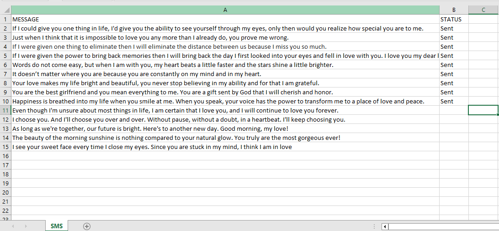

## SMS Automation Bot Process Flow
``````
 - This bot get data from the user's worksheet
 - Process it and login to sms portal site
 - Send sms with the retrieved data 

``````


## Sample Data
[Download Sample Data](https://github.com/geomartins/SMSAutomationBot/blob/master/Assets/selimot_data.xlsx)
``````
-- Sample Data must be in the following path 
         C:\botfiles\selimot_data.xlsx

``````




